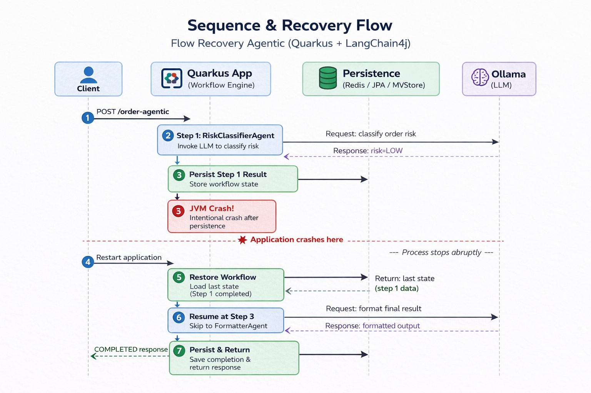

# Flow Recovery Agentic AI (Quarkus Flow + LangChain4j + Persistence)

This project demonstrates **workflow persistence and recovery** using **Quarkus Flow** with **Agentic LangChain4j** across multiple persistence backends:

* File (MVStore)
* Redis
* PostgreSQL (JPA)

The objective is to validate that a workflow can **resume execution from the last persisted step after a crash**, without re-executing completed steps (saving high cost of calling again to the model).

---

## 🚀 Overview

The workflow is composed of three steps:

1. **RiskClassifierAgent**

   * Invokes an LLM (via LangChain4j + Ollama)
   * Produces a risk classification (`LOW`, `HIGH`, …)
   * Persists the result

2. **CrashOnceService**

   * Forces a JVM crash **only once**
   * Simulates a failure after persistence

3. **FormatterAgent**

   * Uses previously persisted data
   * Produces the final result (`COMPLETED`)

---

## 🧠 Recovery Scenario

Expected execution:

1. Workflow starts
2. Step 1 completes and is persisted
3. JVM crashes before Step 3
4. Application restarts
5. Workflow state from first agent is restored from persistence
6. Execution resumes at Step 3
7. Workflow completes successfully

---

## 🔄 Sequence & Recovery Flow



---

## ⚙️ Requirements

* Java 21+
* Maven
* Docker
* Ollama running locally

---

## 🐳 Dependencies

Start required services:

```bash
docker compose up -d
```

Run Ollama:

```bash
ollama serve
ollama pull llama3.2:3b
```

---

## ▶️ Run the application

Build depending on the persistence type:

```bash
mvn clean package -Pfile -Dquarkus.profile=file
mvn clean package -Predis -Dquarkus.profile=redis
mvn clean package -Pjpa -Dquarkus.profile=jpa
```

Run with desired persistence backend:

### Redis

```bash
java -Dquarkus.profile=redis -jar target/quarkus-app/quarkus-run.jar
```

### PostgreSQL (JPA)

```bash
java -Dquarkus.profile=jpa -jar target/quarkus-app/quarkus-run.jar
```

### File (MVStore)

```bash
java -Dquarkus.profile=file -jar target/quarkus-app/quarkus-run.jar
```

---

## 🧪 Trigger the workflow

```bash
curl -X POST http://localhost:8080/workflow/order-agentic \
  -H 'Content-Type: application/json' \
  -d '{"orderId":"crash-1","amount":40,"customerId":"cust-1"}'
```

First execution:

```
curl: (52) Empty reply from server
```

This is expected — the JVM crashes intentionally.

---

## 🔁 Verify recovery

Restart the application:

```bash
java -Dquarkus.profile=<profile> -jar target/quarkus-app/quarkus-run.jar
```

Expected logs after restart (there's no "[STEP 1 - RiskAgent] output=..."):

```
[STEP 2 - CrashOnce] recoveredInput=...
[STEP 3 - FormatterAgent] recoveredInput=...
[STEP 3 - FormatterAgent] output={..., status=COMPLETED}
```

---

## 🗄️ Persistence backends

### Redis

* Key-based storage
* Fast recovery
* Example:

```
<instanceId>:do/0/riskAgent
```

---

### PostgreSQL (JPA)

* Relational storage
* Tables:

  * `ProcessInstanceEntity`

⚠️ Important:

```properties
quarkus.hibernate-orm.database.generation=update
```

---

### File (MVStore)

* Embedded persistence
* Stored locally on disk
* No external dependencies required
* Useful for lightweight recovery testing

---

## 🔍 Debugging persistence

### Redis

```bash
redis-cli --scan --pattern '*:do/*'
```

---

### PostgreSQL

```bash
docker exec -it flow-postgres psql -U flow -d flow
```

```sql
SELECT * FROM ProcessInstanceEntity;
```

---

### File (MVStore)

Inspect the data directory:

```bash
ls target/
```

Look for MVStore files storing workflow state.

---

## 🧪 What this project validates

* Step-level persistence
* Crash recovery correctness
* No re-execution of completed steps
* Agentic workflow compatibility with persistence
* Consistency across different persistence backends

---

## ⚠️ Known behaviors

* First request crashes intentionally
* HTTP response is interrupted
* Recovery happens automatically on restart

---

## 📌 Summary

This project demonstrates that:

> Agentic workflows can be made **fault-tolerant and resumable** using Quarkus Flow persistence across Redis, JPA, and file-based storage.

---

